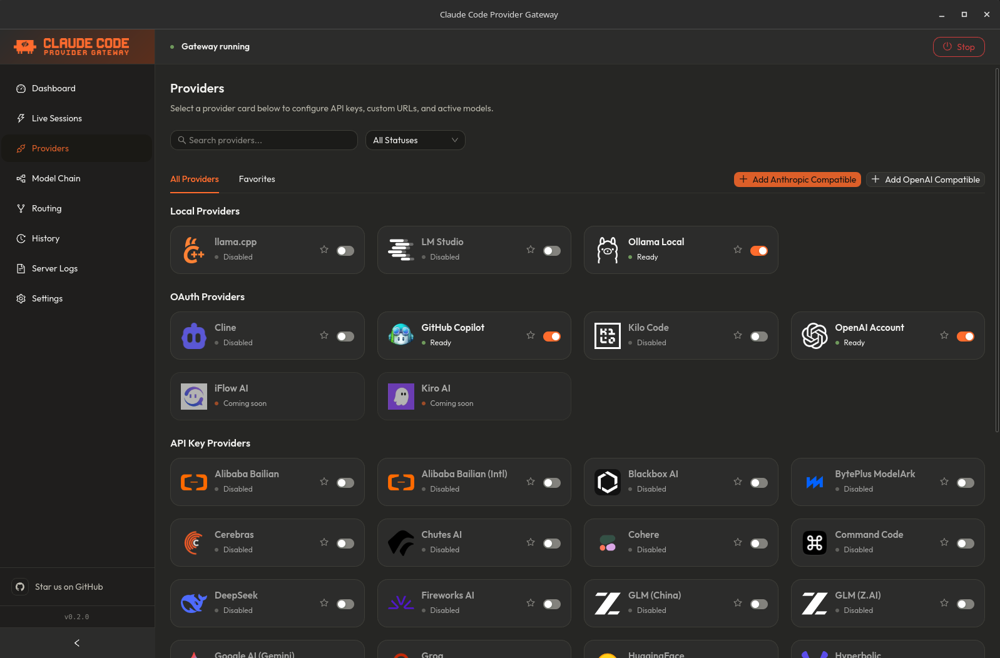
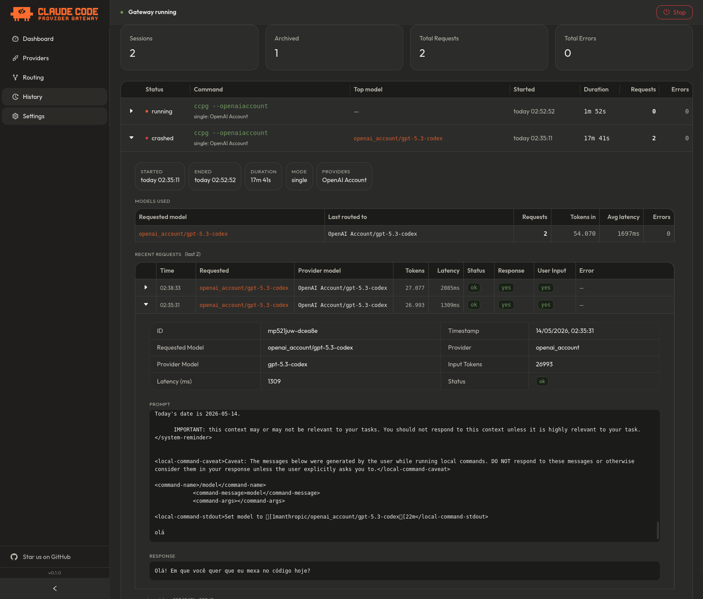
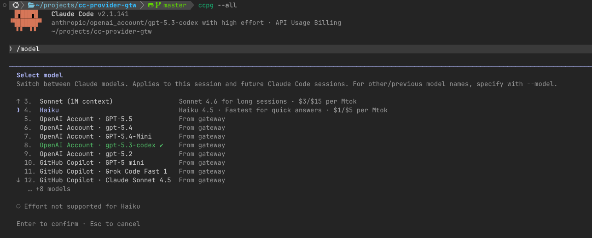

<div align="center">

# Claude Code Provider Gateway

**Claude Code, your provider, one local desktop gateway.**

Run Claude Code through OpenAI Account, GitHub Copilot, OpenRouter, DeepSeek, Groq, xAI, Mistral, GLM, Minimax, Command Code, Ollama, LM Studio, llama.cpp, custom OpenAI/Anthropic-compatible endpoints, and many other providers, while keeping the Claude Code workflow intact.

[](#status)
[](LICENSE)
[](packages/desktop)
[](#supported-providers)
<br />
[](#system-requirements)
[](#pricing)
[](#license)

**Free, open source, and local-first.**

</div>

<p align="center">
  
</p>

<p align="center">
  <a href="docs/APP_SCREENS.md">View app screens</a>
</p>

---

## What This Is

Claude Code Provider Gateway, or CCPG, is a desktop app that starts a local Anthropic-compatible proxy on your machine. Claude Code talks to the gateway. The gateway routes each request to the provider and model you configured, translates protocols when needed, and streams the result back in Anthropic SSE format.

```text
Claude Code -> CCPG desktop app -> local proxy -> your selected LLM provider
```

You keep Claude Code's agent loop, tool use, project context, custom commands, hooks, MCP servers, and IDE workflow. You choose the model backend.

CCPG is not an npm package for end users. It is built to be downloaded, opened, configured in a UI, and left running as a desktop app.

## Why It Exists

Claude Code is one of the best AI coding tools available, but the default experience keeps you tied to one provider, one model catalog, and one pricing model.

CCPG gives you the missing control layer:

- Use cheaper models for routine edits.
- Use stronger reasoning models when the task deserves it.
- Run local models for sensitive code.
- Use Copilot or OpenAI Account auth from a desktop UI.
- See what Claude Code is actually sending in the background.

Everything runs locally. There is no hosted CCPG service, no telemetry, no account system, and no gateway markup. The app is MIT licensed, open source, and designed to run locally.

## TL;DR

1. Download the desktop installer for your OS.
2. Open CCPG. The daemon starts automatically.
3. Add one built-in or custom provider in **Providers** and click **Test**.
4. Install the `ccpg` shell command from **Dashboard -> Shell Setup**.
5. Launch Claude Code:

```bash
ccpg --<provider>
```

> [!WARNING]
> If your `.claude/settings.json` or `.claude/settings.local.json` has an `env` block with `ANTHROPIC_AUTH_TOKEN` or `ANTHROPIC_BASE_URL`, **remove those entries before launching via `ccpg`**. Those env vars override the gateway endpoint and prevent CCPG from routing requests correctly.

After that, switch providers per session:

```bash
ccpg --OpenRouter
ccpg --OpenAIAccount
ccpg --Copilot
ccpg --Ollama
ccpg --all
ccpg --ModelChain
ccpg --my-chain
```

## Status

CCPG is an early release, feedback is welcome, and it is already usable for testing.

v0.1 is available now with desktop installers for macOS, Linux, and Windows.
Expect rough edges, but the core flow is ready:

install app → add provider → test connection → run Claude Code through CCPG.

The production path is desktop-only: users should not need Node.js, npm, Rust, Bun, or hand-edited terminal config.

The next documentation step is a separate official docs site repository. Until then, start with the [documentation hub](docs/README.md) or jump directly to:

- [Getting Started](docs/GETTING-STARTED.md)
- [Providers](docs/PROVIDERS.md)
- [Configuration](docs/CONFIGURATION.md)
- [Architecture](docs/ARCHITECTURE.md)
- [API Reference](docs/API_REFERENCE.md)
- [Development](docs/DEVELOPMENT.md)
- [Troubleshooting](docs/TROUBLESHOOTING.md)

## Features

- **Desktop app, not a terminal science project** - Tauri app for macOS, Windows, and Linux with provider setup, connection tests, routing, logs, and history in one UI.
- **Built-in and custom provider cards** - OAuth, API key, cloud, local, and coming-soon providers out of the box, plus user-created OpenAI-compatible and Anthropic-compatible providers with custom slugs and logos.
- **Anthropic-compatible local proxy** - Claude Code sends Anthropic Messages API requests to `127.0.0.1`; CCPG translates and routes them.
- **Full streaming** - provider responses stream back as Anthropic-style SSE events, with upstream cancellation when the client disconnects.
- **Model routing** - map Claude tiers like `opus`, `sonnet`, and `haiku` to different providers and models.
- **All-providers mode** - aggregate enabled providers into one model catalog and choose by model in Claude Code.
- **Model Chains** - create custom fallback chains from active provider models. A chain tries models in priority order, retries transient failures, and moves to the next model when an upstream provider fails, rate limits, idles before emitting useful content, or returns an empty/malformed stream.
- **Built-in OAuth** - OpenAI Account uses PKCE OAuth. GitHub Copilot and Kilo Code use Device Flow. Cline uses browser authorization. Tokens refresh automatically where supported.
- **Provider management UI** - search providers, filter active/inactive cards, add custom OpenAI/Anthropic-compatible providers, favorite and reorder frequently used providers, edit runtime limits/manual model lists, and hide noisy discovered models.
- **Model Chain timeout controls** - tune request, first-token, and total stream limits per chain from Advanced Settings. Defaults are 30s to first useful token and 60s total stream.
- **Token savers** - Optional RTK-style tool-result compression and Caveman terse-response mode from Settings.
- **Outbound proxy support** - Configure an HTTP/HTTPS proxy in Settings so the daemon routes external requests (OAuth, provider API calls) through your network proxy. Required for users in regions where providers restrict direct access.
- **Local model support** - Ollama, LM Studio, and llama.cpp run through the same Claude Code flow.
- **Request history** - see model, provider, human-readable prompt, sanitized provider request preview, response preview, warnings, input tokens, latency, errors, and session totals.
- **Parallel terminal sessions** - launch multiple `ccpg --<provider>` terminals at once; each session keeps its own provider/model mode, primary model memory, heartbeat, and live request log.
- **Provider safeguards** - per-provider concurrency/rate limits are enforced by the daemon before dispatch, and canceled Claude Code requests abort in-flight upstream calls.
- **Encrypted secrets** - API keys, OAuth tokens, and gateway auth token are split out of config and stored with AES-256-GCM.
- **No telemetry** - no cloud service, no database server, no analytics, no account.

## The Hidden Prompt Viewer

Ever wonder what Claude Code is actually sending to the API?

CCPG logs each request Claude Code sends through the gateway, including background calls that do not appear as normal chat messages. In the History UI you can inspect:

- the requested model and routed provider model
- the human-readable serialized prompt, including the first request's system prompt
- the sanitized provider request preview after routing, token savers, and provider conversion
- tool-use traffic that appears in the message stream
- input token count
- latency to first byte
- provider errors
- conversion warnings for provider-specific feature drops/translations
- captured response text preview

<p align="center">
  
</p>

This is useful for debugging cost, understanding why a model behaved a certain way, and seeing background housekeeping calls that otherwise feel invisible.

## Token Savers

CCPG includes two optional local token-saving features in **Settings -> Token Savers**:

| Feature | What it does | Best for |
|---|---|---|
| RTK compression | Compacts large `tool_result` payloads before the request reaches the provider. | Big `rg`, `git diff`, `git status`, `find`, `ls`, `tree`, numbered file dumps, and repetitive logs. |
| Caveman mode | Injects terse-response guidance into the system prompt. | Reducing response verbosity and output tokens. |

RTK does not change normal chat messages or errored tool results. If a request has no large tool output, there may be nothing to compress. When RTK does compress something, the daemon log records a line with bytes saved and the filter used.

Caveman is different: it does not reduce input tokens. It asks the model to answer more tersely, with levels `lite`, `full`, and `ultra`.

## How `ccpg --all` Works

`ccpg --all` is not round-robin and it does not randomly pick a provider.

When you launch with `--all`, CCPG enables model discovery across every provider you turned on in the app. Claude Code's model picker sees gateway-prefixed model IDs such as:

```text
anthropic/openrouter/anthropic/claude-sonnet-4.5
anthropic/deepseek/deepseek-chat
anthropic/ollama/qwen2.5-coder
```

When Claude Code sends a request for one of those models, CCPG reads the provider prefix and routes the request to that provider and model. If Claude Code later sends background requests using hardcoded Claude tier names, CCPG remembers the primary provider-prefixed model selected in the session and routes those background calls there too.

Use `--all` when you want to choose models from multiple providers inside one Claude Code session. Use `ccpg --DeepSeek`, `ccpg --OpenRouter`, or another single-provider flag when you want a simpler model list.

<p align="center">
  
</p>

## How Model Chains Work

Model Chains let you create user-defined gateway models from the panel. Open
**Model Chains**, create a chain with a name and `chain-slug`, then add models from
active providers and enabled model lists. The order in the chain is the runtime
priority.

Claude Code sees each chain as a single custom model:

```text
{Chain Name} · Gateway:custom-model (Defined by user)
```

Internally, the daemon exposes the model as `anthropic/chain/<slug>`. When a
request hits that chain, CCPG calls the first target model. If the provider
returns an API error, rate limit, credit/quota failure, network failure, or a
200 response whose stream ends, idles, errors, or parses without useful
Anthropic content before any answer content is emitted, CCPG retries that
target and then moves to the next target in the chain. Once useful content has
been emitted, CCPG keeps the stream attached to that provider and does not
rewind partial answers. If the upstream stream fails after content has started,
CCPG closes open content blocks and emits a terminal Anthropic-compatible error
frame before stopping the message. The session stays attached to the chain, so Claude Code
background tier calls continue through the same chain instead of leaking back
to the first provider.

The Model Chain page also includes an **Economy/Local** preset. It builds a
Haiku -> DeepSeek -> Ollama-style waterfall from the providers and models you
already have enabled/configured, skipping unavailable entries instead of
requiring Anthropic-native Claude.

Each chain has optional **Advanced Settings** for fallback timing. Request
timeout controls how long CCPG waits for response headers, first-token timeout
controls how long a target may stall before useful Anthropic content, and total
stream timeout caps one chain attempt. Empty fields use the defaults: 60s
request, 30s first token, and 60s total stream.

Launch modes:

| Command | What Claude Code sees |
|---|---|
| `ccpg --<chain-slug>` | Only that Model Chain. |
| `ccpg --ModelChain` | All enabled Model Chains, and no provider models. |
| `ccpg --all` | Enabled Model Chains plus all enabled provider models. |

Use a single `chain-slug` when you want one controlled fallback path. Use
`--ModelChain` when you want Claude Code's model picker to show every enabled
chain.

## Supported Providers

### OAuth

| Provider | Auth | Notes |
|---|---|---|
| OpenAI Account | OAuth PKCE | Uses your OpenAI account session from the desktop app. |
| GitHub Copilot | OAuth Device Flow | Uses Copilot model access available to your GitHub account. |
| Kilo Code | OAuth Device Flow | Uses a Kilo Code account token and organization id when provided. |
| Cline | OAuth authorization code | Uses the Cline account flow and refreshes tokens when possible. |
| Kiro AI | OAuth placeholder | Visible as coming soon; the OAuth flow is not implemented yet. |
| iFlow AI | OAuth placeholder | Visible as coming soon; the OAuth flow is not implemented yet. |

### API Key Cloud

| Provider | Auth | Notes |
|---|---|---|
| OpenRouter | API key | Broad model catalog through one provider. |
| DeepSeek | API key | Anthropic-compatible endpoint. |
| NVIDIA NIM | API key | OpenAI-compatible endpoint, translated by CCPG. |
| Kimi (Moonshot) | API key | OpenAI-compatible endpoint, translated by CCPG. |
| Google AI (Gemini) | API key | OpenAI-compatible Gemini endpoint, translated by CCPG. |
| Groq, xAI, Mistral, Cerebras, Together AI, Fireworks AI | API key | OpenAI-compatible endpoints, translated by CCPG. |
| GLM, GLM China, SiliconFlow, Hyperbolic, Chutes AI, Perplexity, Nebius AI | API key | Regional and aggregator providers with model prefix routing. |
| Volcengine Ark, BytePlus ModelArk, Alibaba Bailian, Alibaba Bailian Intl | API key | OpenAI-compatible regional cloud providers. |
| Minimax, Minimax China | API key | Anthropic-compatible endpoints. |
| OpenCode Go, Xiaomi MiMo, Xiaomi MiMo Token Plan, Cohere, Blackbox AI, HuggingFace Router, Ollama Cloud | API key | Additional hosted model catalogs. |
| Command Code | API key | Custom provider transport that converts AI SDK v5 NDJSON streams into Anthropic SSE. |
| Custom OpenAI/Anthropic compatible | API key | Add self-hosted or third-party compatible endpoints from the Providers tab with a custom slug, base URL, optional PNG/WebP logo, and manual models when discovery is unavailable. |

### Local

| Provider | Default URL | Notes |
|---|---|---|
| Ollama | `http://localhost:11434` | Pull models in Ollama, then select them in CCPG. |
| LM Studio | `http://localhost:1234/v1` | Load a local model and enable the server. |
| llama.cpp | `http://localhost:8080/v1` | Run the llama.cpp server locally. |

### Anthropic Passthrough

CCPG can also pass native Claude requests through to Anthropic when credentials are available. This is useful when you want Claude models and non-Anthropic models in the same gateway workflow.

See [docs/PROVIDERS.md](docs/PROVIDERS.md) for the complete provider ID list, CLI flags, auth behavior, and contributor notes.

## System Requirements

### For Users

| Platform | Release format | Notes |
|---|---|---|
| macOS Apple Silicon | `.dmg` | Built by CI for `aarch64-apple-darwin`. |
| macOS Intel | `.dmg` | Built by CI for `x86_64-apple-darwin`. |
| Linux x86_64 | `.deb`, `.rpm`, `.AppImage` | CI builds on Ubuntu 22.04 with WebKitGTK dependencies. |
| Linux ARM64 | `.deb`, `.rpm`, `.AppImage` | CI builds on Ubuntu 22.04 ARM. |
| Windows x86_64 | `.msi`, `-setup.exe` | Windows WebView2 is required; it ships with modern Windows 10/11 through Windows Update. |

You also need Claude Code installed and able to run from your shell as `claude`.

### For Source Development

Source development needs Node.js, npm workspaces, Bun, Rust, and Tauri system dependencies. See [docs/DEVELOPMENT.md](docs/DEVELOPMENT.md).

## Install

Download the latest desktop build from:

[GitHub Releases](https://github.com/danielalves96/claude-code-provider-gateway/releases)

Then:

1. Open the app.
2. Add or log into at least one provider.
3. Test the provider connection.
4. Install the `ccpg` shell command from Dashboard -> Shell Setup.
5. Relaunch your shell.
6. Start Claude Code through CCPG.

```bash
ccpg --DeepSeek # Or other configured provider
```

> [!WARNING]
> If your `.claude/settings.json` or `.claude/settings.local.json` has an `env` block containing `ANTHROPIC_AUTH_TOKEN` or `ANTHROPIC_BASE_URL`, **remove those entries**. They override the gateway endpoint and prevent CCPG from intercepting Claude Code's requests.

Any arguments after the provider flag are passed to Claude Code:

```bash
ccpg --DeepSeek --resume <session-id>
ccpg --OpenRouter --dangerously-skip-permissions
ccpg --Ollama --continue
```

## Provider Flags

| Flag | Mode |
|---|---|
| `--OpenAIAccount` | OpenAI Account models |
| `--Copilot` or `--GitHubCopilot` | GitHub Copilot models |
| `--OpenRouter` | OpenRouter models |
| `--DeepSeek` | DeepSeek models |
| `--NvidiaNim` | NVIDIA NIM models |
| `--Kimi` | Kimi models |
| `--Google` or `--GoogleAI` | Google AI (Gemini) models |
| `--Ollama` | Ollama local models |
| `--LMStudio` | LM Studio local models |
| `--LlamaCpp` | llama.cpp local models |
| `--Groq` | Groq models |
| `--XAI` or `--Grok` | xAI models |
| `--Mistral` | Mistral models |
| `--Cerebras` | Cerebras models |
| `--Together` | Together AI models |
| `--Fireworks` | Fireworks AI models |
| `--GLM` or `--ZAI` | GLM models |
| `--SiliconFlow` | SiliconFlow models |
| `--Hyperbolic` | Hyperbolic models |
| `--Chutes` | Chutes AI models |
| `--Perplexity` | Perplexity models |
| `--Nebius` | Nebius AI models |
| `--GLMCN` | GLM China models |
| `--VolcengineArk` or `--Ark` | Volcengine Ark models |
| `--BytePlus` | BytePlus ModelArk models |
| `--Alicode` or `--Bailian` | Alibaba Bailian models |
| `--AlicodeIntl` | Alibaba Bailian Intl models |
| `--Minimax` | Minimax models |
| `--MinimaxCN` | Minimax China models |
| `--OpenCodeGo` | OpenCode Go models |
| `--XiaomiMimo` or `--MiMo` | Xiaomi MiMo models |
| `--XiaomiTokenPlan` | Xiaomi MiMo Token Plan models |
| `--Cohere` | Cohere models |
| `--Blackbox` | Blackbox AI models |
| `--HuggingFace` or `--HF` | HuggingFace Router models |
| `--OllamaCloud` | Ollama Cloud models |
| `--KiloCode` | Kilo Code models |
| `--Cline` | Cline models |
| `--Kiro` | Kiro AI placeholder |
| `--IFlow` | iFlow AI placeholder |
| `--CommandCode` | Command Code models |
| `--all` or `--a` | All enabled providers in one model catalog |
| `--ModelChain`, `--ModelChains`, or `--chains` | All enabled Model Chains |
| `--<chain-slug>` | One enabled Model Chain with the matching slug |
| `--<custom-provider-slug>` | One user-created custom provider with the matching slug |

Flags are case-insensitive in the shell setup flow.

## Pricing

CCPG is free, open source, and runs locally.

There is no hosted CCPG bill. You only pay whatever your selected upstream provider charges, or nothing when you use a local provider. CCPG does not add a per-request fee and does not proxy traffic through a hosted CCPG server.

## Comparison

This table is about product focus, not a claim that other projects are bad. Terminal-first routers are great for technical users. CCPG is trying to make provider switching feel like a desktop product.

| Capability | CCPG | LiteLLM | claude-code-router |
| --- | --- | --- | --- |
| **Install path** | Desktop installer | `pip install` + config file | `npm install` + config file |
| **User interface** | Desktop app | Web admin + terminal | Terminal-first + basic web UI |
| **Session history** | ✅ Full UI with prompt/response preview | ⚠️ Opt-in via `store_prompts_in_spend_logs` | ❌ Plaintext log files only |
| **Per-request token visibility** | ✅ Yes, in history UI | ✅ Yes, in admin UI | ❌ No |
| **Background prompt visibility** | ✅ Yes | ❌ No | ❌ No |
| **OpenAI Account OAuth** | ✅ Built-in PKCE | ❌ Manual / custom | ❌ Manual / custom |
| **GitHub Copilot OAuth** | ✅ Built-in Device Flow | ❌ Manual / custom | ❌ Manual / custom |
| **Kilo Code OAuth** | ✅ Built-in Device Flow | ❌ No | ❌ No |
| **Cline OAuth** | ✅ Built-in authorization code | ❌ No | ❌ No |
| **Local model support** | ✅ Ollama, LM Studio, llama.cpp | ✅ Yes | ✅ Yes |
| **Model Chains / fallback routing** | ✅ Declarative UI, retry + next-model | ✅ Declarative config, error-type chains | ⚠️ Custom JS scripting only |
| **All-providers aggregation** | ✅ `--all` flag, unified model picker | ⚠️ API-level `/models` list, no UI picker | ❌ No |
| **Model tier routing** | ✅ Map opus/sonnet/haiku to any model | ✅ `model_group_alias` + router config | ✅ Slot-based (default/think/background/long) |
| **Parallel terminal sessions** | ✅ Per-session isolation, routing + logs | ⚠️ Concurrent connections, no session isolation | ⚠️ Stateless, no per-session tracking |
| **Token saver / compression** | ✅ RTK tool-result compression + Caveman mode | ✅ `compress()` SDK + `/responses/compact` | ❌ No |
| **Outbound proxy support** | ✅ HTTP/HTTPS proxy in Settings UI | ✅ Via `HTTPS_PROXY` env var | ✅ Via `PROXY_URL` in config |
| **Provider management UI** | ✅ Search, test, favorite, custom logos | ✅ Admin dashboard (add/edit/delete) | ⚠️ Config editor UI, no provider lifecycle |
| **Secrets storage** | ✅ AES-256-GCM encrypted store | ✅ Encrypted via `LITELLM_MASTER_KEY` | ❌ Env variable interpolation only |
| **Windows support** | ✅ `.msi` / `-setup.exe` native installer | ⚠️ Docker or `pip install` | ✅ npm package (Node 18+) |
| **ARM64 / Apple Silicon support** | ✅ Native `.dmg` and Linux ARM builds | ⚠️ pip works natively; Docker ARM images are secondary | ✅ Native via Node.js |
| **No-install desktop experience** | ✅ Download and open | ❌ CLI / Docker setup required | ❌ CLI setup required |
| **Non-technical user focus** | ✅ First-class | ❌ Not the primary target | ❌ Not the primary target |

## How It Works

```text
┌────────────────┐     ┌───────────────────────────────────┐     ┌─────────────────┐
│  Claude Code   │     │   Claude Code Provider Gateway    │     │  OpenRouter     │
│                │────▶│  ┌─────────────────────────────┐  │────▶│  DeepSeek       │
│                │◀────│  │ Proxy :49250                │  │◀────│  OpenAI Account │
│  Anthropic     │ SSE │  │ /v1/messages -> translate   │  │     │  Copilot        │
│  Messages API  │     │  │ /v1/models   -> aggregate   │  │     │  Ollama         │
└────────────────┘     │  └─────────────────────────────┘  │     │  ...            │
                       │  ┌─────────────────────────────┐  │     └─────────────────┘
                       │  │ Desktop Management UI       │  │
                       │  │ Providers · Model Chain     │  │
                       │  │ Routing · History · Logs     │  │
                       │  │ Settings · Shell Setup       │  │
                       │  └─────────────────────────────┘  │
                       └───────────────────────────────────┘
```

Every request goes through the same basic flow:

1. Claude Code sends `POST /v1/messages` to CCPG's local proxy.
2. CCPG authenticates the local request with its generated gateway token.
3. CCPG resolves the target provider and model from the selected launch mode, model prefix, or routing rules.
4. CCPG applies enabled token savers to the request.
5. CCPG converts Anthropic Messages to the provider's native format when needed.
6. CCPG streams the response back as Anthropic-compatible SSE.
7. CCPG records session metadata and request details locally.

## Runtime Storage

Runtime files live in:

- Linux/macOS: `~/.config/claude-code-provider-gateway/`
- Windows: `%APPDATA%/claude-code-provider-gateway/`

| File | Purpose |
|---|---|
| `config.json` | Non-sensitive provider settings, routing rules, Model Chains, token saver settings, ports, and model mode. |
| `secrets.enc.json` | API keys, OAuth tokens, and auth token encrypted with AES-256-GCM. |
| `secret.key` | Local master key, unless `CC_GATEWAY_SECRET_KEY` is provided. |
| `provider-logos/` | Uploaded PNG/WebP logos for user-created custom providers. |
| `daemon.pid` | PID marker used by the daemon and desktop supervisor. |
| `daemon.log` | Local daemon log file. May include provider errors and request diagnostics. |
| `current-session.json` | Active session checkpoints for currently running `ccpg` launches. |
| `sessions.jsonl` | Completed session archive, capped to 200 sessions. |

## Documentation

| Document | Use it for |
|---|---|
| [Documentation Hub](docs/README.md) | The complete docs map and reading paths for users, contributors, and maintainers. |
| [App Screens](docs/APP_SCREENS.md) | Preview the desktop app UI before installing it. |
| [Getting Started](docs/GETTING-STARTED.md) | Install the desktop app, configure a provider, and launch Claude Code through `ccpg`. |
| [Providers](docs/PROVIDERS.md) | Provider catalog, auth modes, CLI flags, model discovery, Model Chains, and panel behavior. |
| [Configuration](docs/CONFIGURATION.md) | Config file shape, environment variables, defaults, secrets, and runtime storage. |
| [Architecture](docs/ARCHITECTURE.md) | System layers, request lifecycle, routing, provider transports, security model, and storage. |
| [Panel Features](docs/PANEL_FEATURES.md) | Management UI feature modules and frontend organization. |
| [API Reference](docs/API_REFERENCE.md) | Local proxy and panel endpoints used by Claude Code, the desktop UI, and shell setup. |
| [Daemon Reference](docs/DAEMON_REFERENCE.md) | Backend module reference for the proxy, panel API, providers, sessions, and observability. |
| [Adding a Provider](docs/ADDING_PROVIDER.md) | Checklist and implementation patterns for new provider support. |
| [Codebase Guide](docs/CODEBASE_GUIDE.md) | Repository structure, conventions, extension points, and verification checklist. |
| [Development](docs/DEVELOPMENT.md) | Source setup, desktop dev, tests, builds, release flow, and package scripts. |
| [Testing](docs/TESTING.md) | Test runner, layout, commands, coverage expectations, and CI integration. |
| [Troubleshooting](docs/TROUBLESHOOTING.md) | Practical fixes for launch, provider, OAuth, proxy, Model Chain, history, and build issues. |
| [Maintenance Notes](docs/MAINTENANCE.md) | Known limitations, fragile areas, and maintenance review checklists. |
| [Contributing](CONTRIBUTING.md) | Issues, PRs, conventions, and contribution workflow. |
| [Security](SECURITY.md) | Local threat model and vulnerability reporting. |
| [Changelog](CHANGELOG.md) | Release notes. |

## License

MIT © [Daniel Luiz Alves 🇧🇷](https://github.com/danielalves96)
