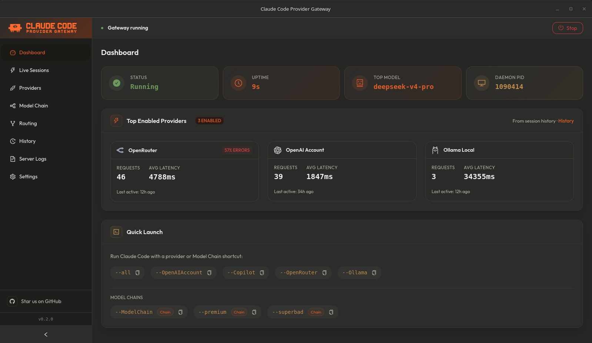
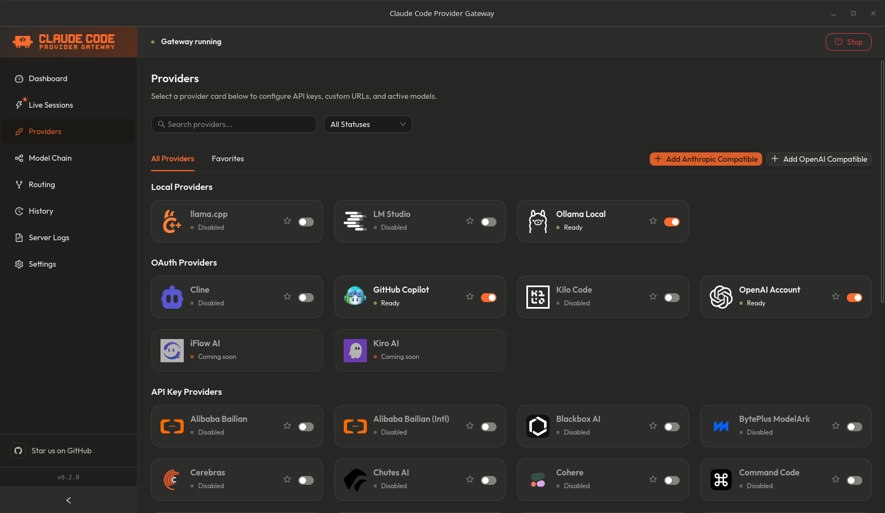
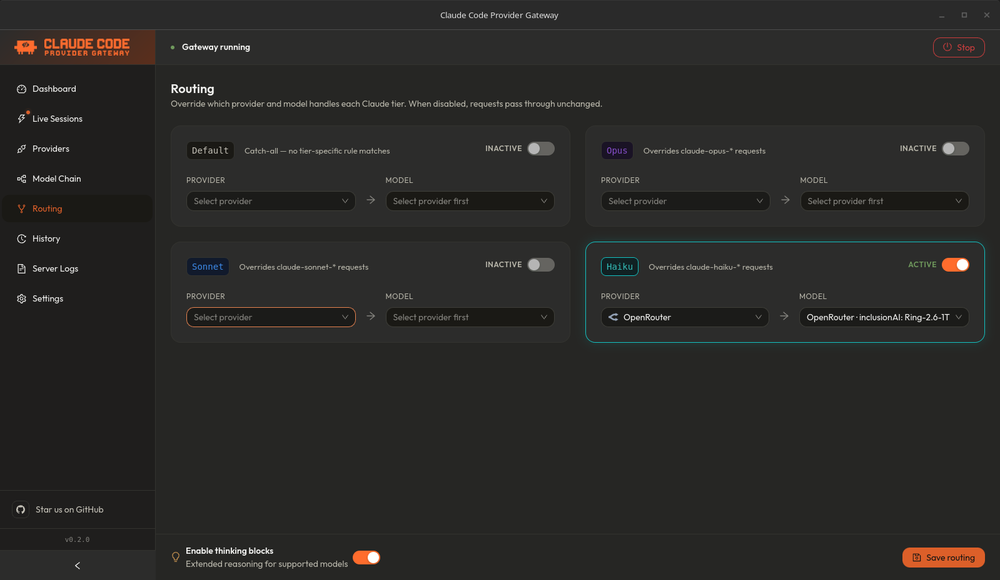
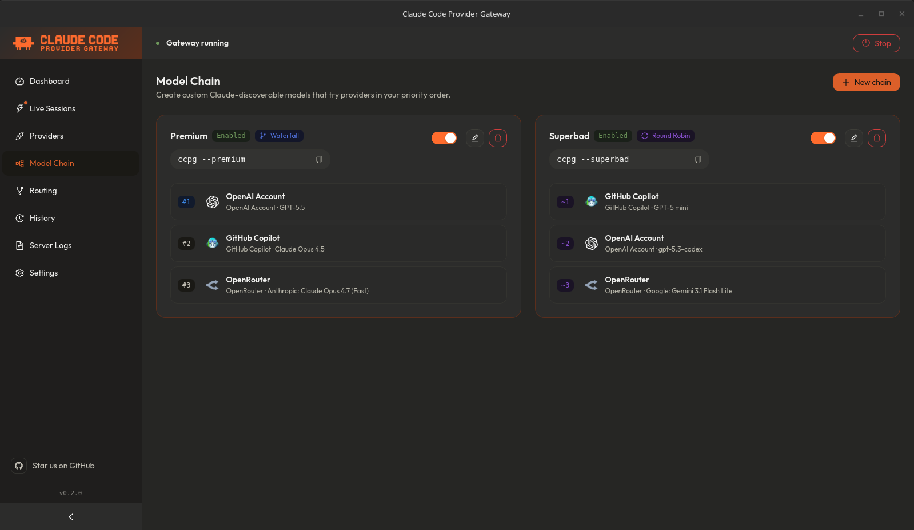
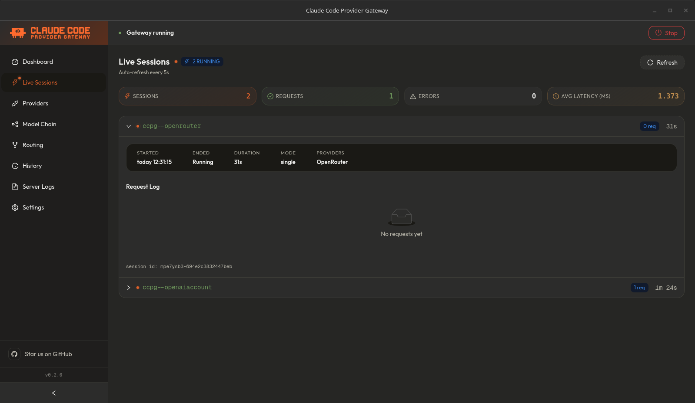
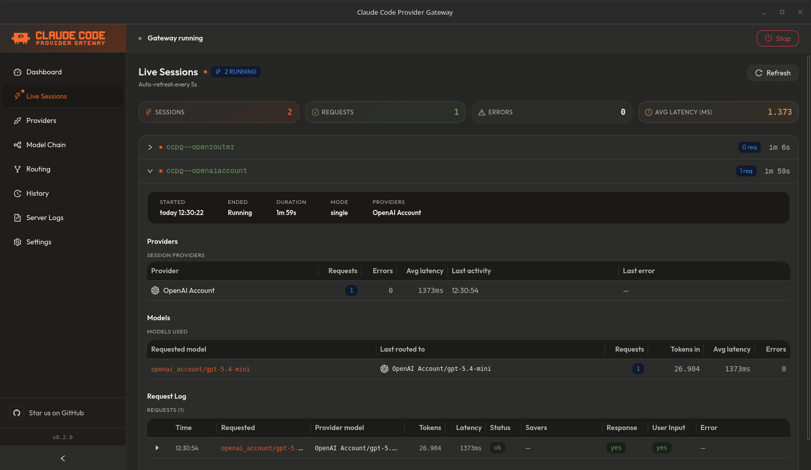
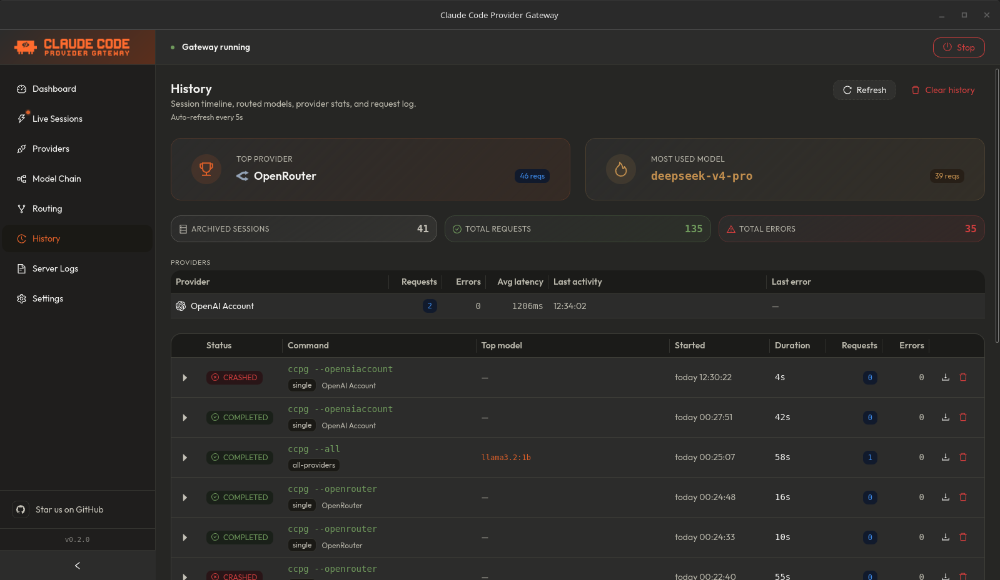
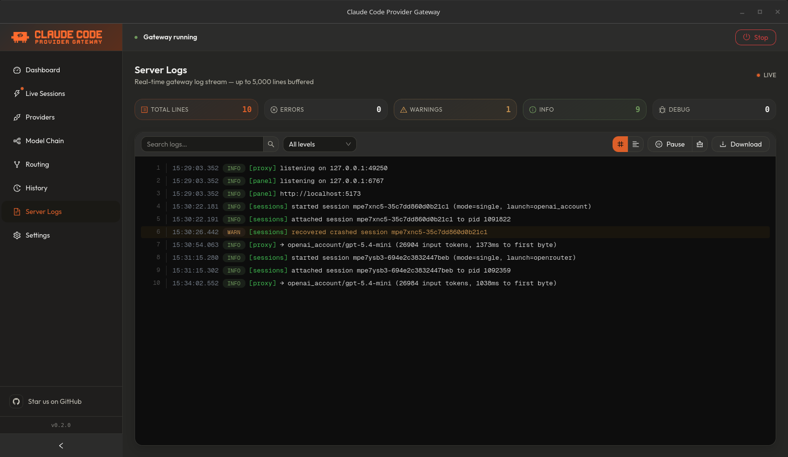
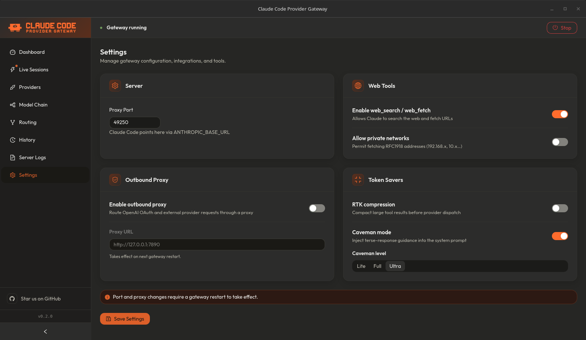

# App Screens

Use this page to preview the CCPG desktop app before installing it. These screens show the main management areas: dashboard, providers, model routing, model chains, live sessions, history, logs, and settings.

## Dashboard

The dashboard shows daemon status, active providers, live gateway activity, and shell setup actions.

  

## Providers

The Providers screen is where users enable built-in providers, configure credentials, test connections, favorite providers, and add custom compatible endpoints.

  

## Model Routing

Model Routing maps Claude Code tiers to the provider models you want CCPG to use.

  

## Model Chains

Model Chains let users create fallback chains from active provider models and expose each chain as a single Claude Code model.

  

## Live Session

Live Session shows the currently running Claude Code gateway session.

  

When requests are flowing, the same screen shows routed provider activity and session request details.

  

## History

History records completed sessions and request-level details, including providers, models, token counts, latency, errors, prompt previews, and response previews.

  

## Server Logs

Server Logs expose local daemon output for debugging provider issues, launch problems, and gateway behavior.

  

## Settings

Settings controls proxy behavior, token savers, server options, and other local gateway preferences.

  

