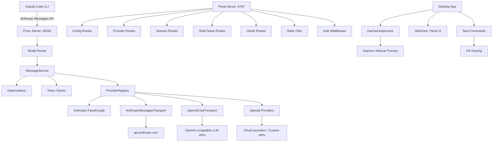

<!-- generated-by: gsd-doc-writer -->

# Architecture

## System Overview

Claude Code Provider Gateway (CCPG) is a **local-first, desktop-hosted gateway** that interposes an Anthropic Messages API-compatible proxy between Claude Code and any of 43+ LLM providers. The system is organized as a monorepo with three packages:

- **Daemon** — A TypeScript/Node.js backend that runs two Hono HTTP servers on `127.0.0.1`: an Anthropic-compatible proxy API and a web panel API.
- **Panel** — A React 19 SPA (Ant Design, Zustand, React Router) that serves as the configuration UI, live session viewer, and provider management dashboard.
- **Desktop** — A Rust/Tauri 2 shell that packages the daemon as a sidecar process and wraps the panel in a native window, delivering a zero-command-line desktop experience.

The architectural style is **layered**: the daemon is split into configuration, runtime, proxy (routing → providers → transport), panel (API + static serving), and observability layers. The desktop shell adds a supervisor layer that manages the daemon lifecycle.

```text
Claude Code ── Anthropic API ──► Proxy Server (127.0.0.1:49250)
                                 ├── Model Router: decode model → provider
                                 ├── Provider layer: 43+ provider implementations
                                 ├── Transport: Anthropic native / OpenAI conversion
                                 └── Stream → Anthropic SSE back to Claude Code

User Browser ─────────────────► Panel Server (127.0.0.1:6767)
                                 ├── Config/Provider/Session/Shell APIs
                                 └── Static files (React SPA)

Desktop App (Tauri) ──────────── DaemonSupervisor: sidecar lifecycle
                                 └── WebView: loads Panel on localhost
```

## Component Diagram



## Data Flow

A typical Claude Code request follows this path:

1. **Entry**: Claude Code sends an Anthropic Messages API request (`POST /v1/messages`) to the proxy server on `127.0.0.1:{proxyPort}`. The `requireAnthropicAuth` middleware validates the auth token from the `x-api-key` header.

2. **Optimization Check**: `MessageService.createMessage()` first passes non-Claude-tier requests through `tryOptimize()`. Known housekeeping requests (network probes, title generation, file path suggestions) are answered locally without hitting any provider, saving quota and reducing latency.

3. **Token Saving**: For real requests, the RTK (Recursive Token Knapsack) module compresses long conversation history, and the Caveman module simplifies system prompts when enabled.

4. **Model Resolution**: `resolveModel()` identifies the target provider by parsing the requested model name (four strategies, in order):
   - **Model fallback chain** (`chain/<slug>` or `fallback/<slug>`): use a sequence of provider/model pairs.
   - **Provider prefix** (`nvidia_nim/glm4.7`): direct provider routing.
   - **Claude tier matching** (opus/sonnet/haiku): user-configured routing rules per tier.
   - **Passthrough**: send the original model name to the active provider.

5. **Native Claude Detection**: If the requested model is a native Claude model (e.g., `claude-sonnet-4-20250514`) and the active provider is disabled, the request is forwarded to Anthropic directly using the user's stored Claude.ai credentials (`~/.claude/.credentials.json`).

6. **Provider Execution**: The `ProviderRegistry` returns the provider instance, which translates the request to the target API format (Anthropic-native or OpenAI Chat Completions), sends it with the configured API key/headers, and streams the SSE response back.

7. **Response Streaming**: Results are streamed back to Claude Code in Anthropic SSE format (`message_start`, `content_block_start`, `content_block_delta`, `content_block_stop`, `message_delta`, `message_stop`). OpenAI-compatible providers are converted from OpenAI SSE chunks to Anthropic SSE format via `openaiToAnthropicSSE()`.

8. **Session Recording**: Every request is recorded to `current-session.json` (checkpointed every 10s), with stats tracking per provider and per model.

## Key Abstractions

| Abstraction | File | Description |
|---|---|---|
| `BaseProvider` | `packages/daemon/src/proxy/providers/base.ts` | Abstract base class for all LLM providers. Defines `streamResponse()`, `listModels()`, `testConnection()`, auth handling, and timeout configuration. |
| `AnthropicMessagesTransport` | `packages/daemon/src/proxy/providers/transport-anthropic.ts` | Provider base for APIs that speak Anthropic Messages format natively (OpenRouter, DeepSeek, Ollama, LM Studio, etc.). Extends `BaseProvider`. |
| `OpenAIChatTransport` | `packages/daemon/src/proxy/providers/transport-openai.ts` | Provider base for OpenAI Chat Completions APIs. Converts Anthropic requests to OpenAI format and streams back as Anthropic SSE. Extends `BaseProvider`. |
| `OAuthStubProvider` | `packages/daemon/src/proxy/providers/oauth-stub.ts` | Placeholder for OAuth-flow providers not yet fully implemented. Rejects requests with a clear "not implemented" message. Extends `BaseProvider`. |
| `ProviderRegistry` | `packages/daemon/src/proxy/providers/registry.ts` | Maps `ProviderId` → provider constructor, caches instances, resolves the active provider. Created by `ProxyRuntime`. |
| `ProxyRuntime` | `packages/daemon/src/proxy/runtime.ts` | Holds the current `Config` and `ProviderRegistry`, with hot-reload via `reloadConfig()`. Used by all proxy middleware and services. |
| `PanelRuntime` | `packages/daemon/src/panel/runtime.ts` | Holds the current `Config` with a `saveConfig()` callback for persisting changes from the web UI. |
| `MessageService` | `packages/daemon/src/proxy/services/message-service.ts` | Orchestrates the full message lifecycle: optimization → token saving → model routing → provider selection → streaming, with model fallback retry logic. |
| `Config` (type) | `packages/daemon/src/config/schema.ts` | Central TypeScript type defining the entire gateway configuration: server ports, 43+ provider configs, routing rules (per Claude tier), thinking settings, web tools, token savers, model fallbacks, and more. |
| `DaemonSupervisor` | `packages/desktop/src-tauri/src/daemon_supervisor.rs` | Rust struct managed as Tauri state. Owns the daemon sidecar process lifecycle (spawn, kill, status) behind a `tokio::sync::Mutex`. |

## Directory Structure Rationale

```
cc-provider-gtw/
├── packages/
│   ├── daemon/           # Backend: proxy server + panel API (TypeScript, Hono)
│   │   └── src/
│   │       ├── config/       # Config loading, schema types, validation, secrets
│   │       ├── core/         # Shared domain types: Anthropic types, SSE writer, token counting
│   │       │   ├── anthropic/   # Anthropic Messages API request/response types, conversion helpers
│   │       │   ├── files/       # File-system utilities (MCP file serving)
│   │       │   └── sse/         # SSE event writers (server-sent events formatting)
│   │       ├── observability/ # Structured logging
│   │       ├── panel/        # Panel HTTP API: config/providers/sessions/shell/oauth/static routes
│   │       ├── proxy/        # Proxy HTTP API: Anthropic routes, model router, providers, services
│   │       │   ├── middleware/   # Auth middleware for proxy and panel
│   │       │   ├── providers/    # 43+ provider implementations + registry + transports
│   │       │   ├── routes/       # Route registration for /v1/messages, /v1/models, status
│   │       │   ├── services/     # MessageService, ModelService, stream handling, fallback logic
│   │       │   └── token-savers/ # RTK (prompt compression) and Caveman (system prompt simplification)
│   │       └── runtime/       # Daemon process lifecycle, sessions, stats, network config
│   ├── panel/            # Frontend: React 19 SPA (Ant Design, Zustand, Vite)
│   │   └── src/
│   │       ├── app/          # App shell, routing, theme provider
│   │       ├── features/     # Feature modules: dashboard, live-session, providers, routing, settings, history, logs, model-chain, shell
│   │       └── shared/       # Shared utilities: API client, hooks, components
│   └── desktop/          # Desktop app: Rust/Tauri 2 shell
│       └── src-tauri/
│           └── src/          # Commands, daemon_supervisor, config, master_key, external_url
├── scripts/              # Build/release helper scripts
├── biome.jsonc           # Biome linter/formatter config (monorepo root)
└── tsconfig.json         # Shared TypeScript config (ES2022, NodeNext)
```

- **`packages/daemon/src/config/`** — Configuration is the single source of truth. Every provider default, route rule, and port is typed here. Hot-reload is supported: the proxy re-reads config on every request.
- **`packages/daemon/src/core/`** — Domain-agnostic shared code. The Anthropic types (`types.ts`) define the canonical request/response shapes that both the proxy API and provider transports depend on.
- **`packages/daemon/src/proxy/providers/`** — Each provider file follows one of three patterns: special standalone class (e.g., `copilot.ts`, `openai-account.ts`), factory-generated transport (`provider-factory.ts`), or OAuth stub. The registry maps string IDs to these constructors.
- **`packages/daemon/src/proxy/services/`** — The service layer owns the orchestration logic that sits between routes and providers: message dispatching, model resolution, fallback chaining, token saving coordination, and stream result assembly.
- **`packages/daemon/src/panel/`** — The panel is a second Hono app on a separate port. Its routes serve the configuration API consumed by the React frontend, plus a static file server that delivers the built panel SPA.
- **`packages/panel/`** — Follows a feature-based organization. Each feature (providers, routing, settings, live-session, etc.) has its own directory with components, hooks, and API integration.
- **`packages/desktop/`** — The Tauri shell owns the daemon process lifecycle via `DaemonSupervisor`, manages the OS keyring for credential storage, and wraps the panel frontend in a native webview.
