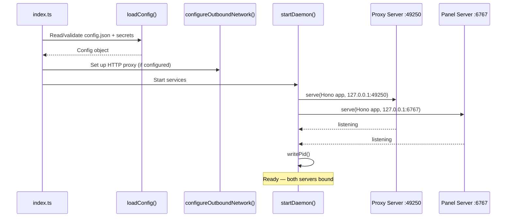
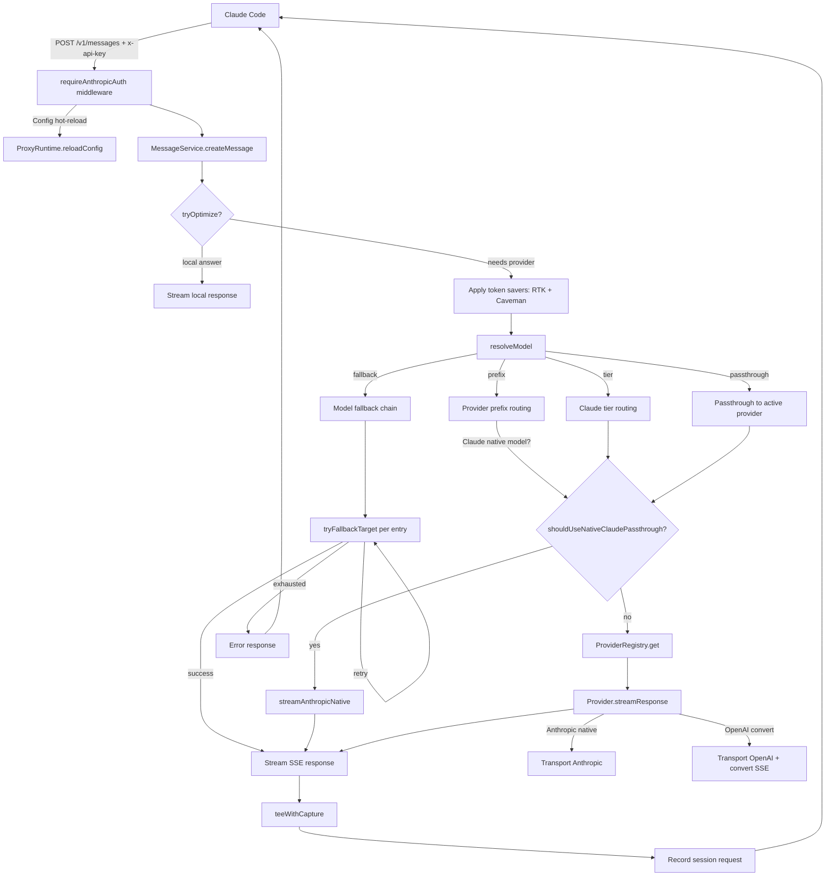

<!-- generated-by: gsd-doc-writer -->

# Daemon Reference

## Overview

The **daemon** (`@claude-code-provider-gateway/daemon`) is the backend process of CCPG, implemented in TypeScript. It runs two local HTTP servers — a **proxy API** (port `49250`) that speaks the Anthropic Messages API, and a **panel API** (port `6767`) that serves the configuration web UI and REST endpoints. Both servers bind to `127.0.0.1` only.

The daemon's primary job is to intercept Claude Code API requests, route them to a built-in or user-created LLM provider, translate between Anthropic and OpenAI API formats, and stream responses back as Anthropic SSE. It also provides session tracking, runtime stats, live logging, and a full configuration API consumed by the panel frontend.

```text
Claude Code ── Anthropic API ──► Proxy (:49250) ──► built-in + custom LLM providers
User Browser ─────────────────► Panel (:6767)  ──► Config + Session + Stats
```

## Entry Point

**File:** `packages/daemon/src/index.ts`

The entry point performs three operations in sequence:

```ts
const config = loadConfig();
configureOutboundNetwork(config.proxy.enabled ? config.proxy.url : undefined);
startDaemon(config);
```

1. **`loadConfig()`** — Reads `config.json` from `~/.config/claude-code-provider-gateway/` (or creates it on first run with sensible defaults), hydrates encrypted secrets from the on-disk store, and validates all fields.

2. **`configureOutboundNetwork()`** — If the user has configured an HTTP/HTTPS proxy (e.g., corporate network), sets the global `undici` dispatcher and overrides `globalThis.fetch` so all outbound provider requests route through the proxy. Localhost no-proxy hosts (`127.0.0.1`, `::1`, `localhost`) are added automatically.

3. **`startDaemon()`** — Creates two Hono apps (proxy + panel), binds them via `@hono/node-server` `serve()`, and registers `SIGINT`/`SIGTERM` handlers for graceful shutdown (ends active sessions, removes the PID file, closes all connections).

## Module Structure

```text
packages/daemon/src/
├── index.ts               # Entry point: load config → configure network → start servers
├── config/                 # Schema, defaults, validation, paths, encrypted secrets
│   ├── index.ts            # loadConfig(), saveConfig(), buildDefaultConfig(), ConfigManager logic
│   ├── schema.ts           # Config type, ProviderConfig, built-in ProviderId constants, PROVIDER_DEFAULTS
│   ├── paths.ts            # OS-aware config dir paths (~/.config/... on Linux/Mac, %APPDATA% on Win)
│   ├── validation.ts       # normalizeConfig() — validates and backfills all config fields
│   └── secrets/            # Secret storage layer
│       ├── store.ts        # SecretStore interface + SECRET_KEYS constants
│       ├── encrypted-file-store.ts  # EncryptedFileSecretStore (AES-256-GCM)
│       ├── config-splitter.ts       # extractSecretsToStore() / hydrateSecretsFromStore()
│       └── master-key.ts   # Master key resolution: CC_GATEWAY_SECRET_KEY env → key file → generate
├── core/                   # Shared domain primitives (no provider-specific logic)
│   ├── anthropic/
│   │   ├── types.ts        # MessagesRequest/Response, Message, ContentBlock, Tool, Usage, ModelInfo
│   │   ├── conversion.ts   # anthropicToOpenAI() — converts Anthropic Messages → OpenAI Chat Completions
│   │   └── tokens.ts       # Token counting via js-tiktoken
│   ├── sse/
│   │   └── writer.ts       # SSE event serialization: message_start, content_block_delta, etc.
│   └── files/
│       └── private-file.ts # writePrivateFile(), appendPrivateFile() with 0o600 permissions
├── proxy/                  # Anthropic Messages API proxy server
│   ├── app.ts              # createProxyApp() — Hono app factory
│   ├── runtime.ts          # ProxyRuntime — holds Config + ProviderRegistry for the proxy
│   ├── model-router.ts     # resolveModel() — decodes model name → provider target
│   ├── errors.ts           # Anthropic error types + provider status code mapping
│   ├── optimizations.ts    # Local optimizations for known housekeeping requests
│   ├── middleware/
│   │   └── auth.ts         # requireAnthropicAuth — Bearer/x-api-key validation
│   ├── routes/
│   │   ├── anthropic-routes.ts  # POST /v1/messages, /v1/messages/count_tokens, GET /v1/models
│   │   └── status-routes.ts     # GET /v1/status (service health)
│   ├── services/
│   │   ├── message-service.ts   # MessageService — full message lifecycle + fallback retry
│   │   ├── model-service.ts     # ModelService — model listing (mode-aware)
│   │   ├── native-claude-routing.ts # Native Claude passthrough detection
│   │   ├── prompt-serializer.ts     # Request audit trail serialization
│   │   └── stream-result.ts     # SSE stream response helpers with response capture
│   ├── providers/           # Built-in provider implementations and shared transports
│   │   ├── base.ts              # BaseProvider abstract class
│   │   ├── registry.ts          # ProviderRegistry — ID → constructor mapping + caching
│   │   ├── provider-factory.ts  # createOpenAIProvider() / createAnthropicProvider() factories
│   │   ├── transport-anthropic.ts # AnthropicMessagesTransport (native Anthropic API)
│   │   ├── transport-openai.ts    # OpenAIChatTransport (OpenAI Chat Completions API)
│   │   ├── api-client.ts         # postProviderStream(), fetchProviderJson() HTTP wrappers
│   │   ├── model-prefix.ts       # Gateway model ID prefix stripping
│   │   ├── anthropic-passthrough.ts # Native Anthropic (claude.ai) credential passthrough
│   │   ├── copilot.ts / copilot-auth.ts / copilot-catalog.ts / copilot-chat-stream.ts
│   │   ├── openai-account.ts / openai-account-auth.ts / openai-account-stream.ts
│   │   ├── cline.ts / cline-auth.ts
│   │   ├── kilocode.ts / kilocode-auth.ts
│   │   ├── kiro.ts / iflow.ts / commandcode.ts
│   │   ├── deepseek.ts / google.ts / ollama.ts / ollama-cloud.ts
│   │   └── oauth-stub.ts        # Placeholder for unimplemented OAuth flows
│   └── token-savers/        # Token optimization modules
│       ├── rtk.ts               # Recursive Token Knapsack — compresses conversation history
│       └── caveman.ts           # Caveman — simplifies system prompts
├── panel/                  # Panel web API server
│   ├── app.ts              # createPanelApp() — Hono app factory with auth middleware + static files
│   ├── runtime.ts          # PanelRuntime — holds Config + ProviderRegistry + OAuth flows
│   ├── contracts.ts        # TypeScript types for all panel API responses
│   ├── launch-prepare.ts   # prepareLaunch() — handles --Provider flags, env setup, session lifecycle
│   ├── shell-setup.ts      # Shell RC snippet generation + installation (zsh/bash/fish/powershell)
│   ├── middleware/
│   │   └── auth.ts         # requirePanelAccess — CORS + token auth for Tauri origins
│   ├── routes/
│   │   ├── config-routes.ts    # GET/PUT /api/config
│   │   ├── provider-routes.ts  # Provider list/test/models, custom providers, logo serving, routing options
│   │   ├── session-routes.ts   # GET/DELETE /api/sessions, /api/launch/*
│   │   ├── shell-routes.ts     # Shell setup, launch commands, launch-prepare
│   │   ├── oauth-routes.ts     # OAuth flows: OpenAI Account, Copilot, KiloCode, Cline
│   │   ├── oauth-pages.ts      # HTML pages for OAuth callback (success/error/bad request)
│   │   ├── status-routes.ts    # GET /api/status, /api/stats, /api/logs (SSE stream)
│   │   └── static-routes.ts    # Serves the panel React SPA from dist/
│   └── static/             # Placeholder for built panel SPA
├── runtime/                # Process lifecycle, sessions, and runtime stats
│   ├── daemon.ts           # startDaemon() — creates + binds proxy and panel servers
│   ├── process.ts          # PID file management (write/read/remove/isRunning/getDaemonStatus)
│   ├── network.ts          # configureOutboundNetwork() — undici proxy + global fetch override
│   ├── sessions.ts         # Session lifecycle: start, record request, heartbeat, end, archive
│   ├── session-types.ts    # SessionRecord, SessionRequestLogEntry, TokenSaverStats types
│   ├── session-store.ts    # JSONL archive + current-session checkpoint persistence
│   ├── session-stats.ts    # Per-model and per-provider stat aggregation
│   └── stats.ts            # In-memory per-provider runtime stats
└── observability/          # Logging
    └── log.ts              # Structured logger + SSE log emitter for live panel feed
```

## Dual-Server Architecture

The daemon runs two independent Hono HTTP servers on separate ports:

### Proxy Server (port `49250`)

Bound by `createProxyApp()` in `proxy/app.ts`. Implements the Anthropic Messages API:

| Method | Path | Purpose |
|--------|------|---------|
| `POST` | `/v1/messages` | Main inference endpoint — receives Anthropic Messages requests, routes to target provider |
| `POST` | `/v1/messages/count_tokens` | Token counting for the given messages+system+tool input |
| `GET` | `/v1/models` | Model listing (mode-aware: single/all/chains) |
| `HEAD`/`OPTIONS` | `/v1/messages` | CORS preflight for health checks |

All `/v1/*` routes require authentication via `requireAnthropicAuth` middleware, which validates `Authorization: Bearer <token>` or `x-api-key: <token>` headers against the server's `authToken`.

The proxy uses a `ProxyRuntime` instance that holds the current `Config` and a `ProviderRegistry`. Config is reloaded from disk on every request (hot-reload), so panel changes take effect without restarting.

### Panel Server (port `6767`)

Bound by `createPanelApp()` in `panel/app.ts`. Provides the REST API consumed by the React SPA and desktop Tauri webview:

| Group | Endpoints | Purpose |
|-------|-----------|---------|
| Status | `GET /api/status`, `GET /api/stats`, `GET /api/logs` | Health, per-provider stats, live log SSE stream |
| Config | `GET /api/config`, `PUT /api/config` | Full config read/update with secrets masking |
| Providers | `GET /api/providers`, `GET /api/models/:id`, `POST /api/providers/:id/test`, `POST /api/custom-providers/test`, `POST /api/custom-providers`, `DELETE /api/custom-providers/:id`, `GET /api/provider-logos/:file` | Provider listing, model discovery, connection testing, user-created custom providers, uploaded custom logos |
| Routing | `GET /api/routing/options` | Model selection options for routing rules |
| Sessions | `GET /api/sessions`, `DELETE /api/sessions` | Current + archived sessions, clear history |
| Launch | `POST /api/launch/end`, `/api/launch/heartbeat`, `/api/launch/attach` | Session lifecycle from CLI launcher |
| Shell | `GET /api/shell-setup`, `GET /api/launch-commands`, `POST /api/launch/prepare` | Shell integration, CLI flags, launch-prepare |
| OAuth | `POST /api/providers/:id/oauth/start`, `/logout`, `/status` | OAuth flows for OpenAI Account, Copilot, KiloCode, Cline |
| Control | `POST /api/control/shutdown` | Graceful daemon shutdown |
| Static | `GET /*` (fallthrough) | Serves the panel React SPA from `dist/` |

Auth on the panel uses `requirePanelAccess` middleware, which allows requests from Tauri webview origins (`tauri://localhost`) and development origins (`localhost:5173`), and requires the server auth token for sensitive mutation endpoints (config write, shell setup, OAuth flows, shutdown).

### Lifecycle



## Key Classes

### `BaseProvider`

**File:** `packages/daemon/src/proxy/providers/base.ts`

Abstract base class for all LLM provider implementations. Defines the contract every provider must fulfill:

```ts
export abstract class BaseProvider {
  constructor(protected readonly config: ProviderConfig) {}

  abstract get id(): string;           // Provider identifier (e.g., "openrouter")
  abstract get label(): string;        // Human-readable name (e.g., "OpenRouter")

  abstract streamResponse(
    req: MessagesRequest,
    inputTokens: number,
    options?: ProviderRequestOptions,
  ): Promise<StreamResult>;
  abstract listModels(): Promise<ModelInfo[]>;
}
```

**Built-in behavior:**

| Method | Purpose |
|--------|---------|
| `listEnabledModels()` | Calls `listModels()` and filters out `disabledModels` from config |
| `testConnection()` | Calls `listEnabledModels()` and measures latency; returns `{ ok, latencyMs, modelCount }` |
| `baseUrl()` | Returns `config.baseUrl` |
| `authHeader()` | Returns `Bearer ${config.apiKey}` |
| `requiresApiKey()` | Returns `true` by default |
| `hasApiKey()` | Checks if `config.apiKey` is non-empty |
| `missingApiKeyMessage()` | Human-readable message when no API key is configured |
| `requestTimeoutMs(options?)` | Uses per-call overrides first, then provider config, then the default request timeout |
| `streamIdleTimeoutMs(options?)` | Uses per-call overrides first, then provider config; Model Chains handle first-token fallback probing separately |
| `streamTotalTimeoutMs(options?)` | Uses per-call overrides first, then provider config |

**Provided result type:**

```ts
interface StreamResult {
  stream?: ReadableStream<string>;  // Anthropic SSE stream on success
  error?: { status: number; message: string };  // HTTP error on failure
}
```

### `ProviderRegistry`

**File:** `packages/daemon/src/proxy/providers/registry.ts`

Maps `ProviderId` strings to provider constructor classes, caches provider instances, and provides the active provider resolution.

```ts
export class ProviderRegistry {
  constructor(private config: Config) {}

  get(id: ProviderId): BaseProvider | null;   // Lazy-instantiate enabled provider
  getActive(): BaseProvider | null;           // Shortcut for get(config.activeProvider)
  updateConfig(config: Config): void;         // Hot-reload: replace config, clear cache
  all(): Array<{ id: ProviderId; provider: BaseProvider }>;  // All enabled providers
}
```

**Key details:**

- **Lazy instantiation**: Provider instances are created on first access (`get()`) and cached in a `Map`. Disabled providers return `null`.
- **Hot-reload**: `updateConfig()` replaces the stored config and clears the cache so next access uses fresh configuration.
- **Provider map**: The `PROVIDER_MAP` constant maps the built-in provider IDs to constructors. Most built-ins use factory-generated classes (`createOpenAIProvider()` / `createAnthropicProvider()`); special providers (Copilot, OpenAI Account, Cline, KiloCode, Kiro, iFlow, DeepSeek, Google, Ollama, Ollama Cloud, CommandCode) have dedicated hand-written classes.
- **Dynamic custom providers**: IDs not present in `PROVIDER_MAP` can still be instantiated when `config.providers.<id>.custom` exists. `custom.compatibility: "openai"` creates an `OpenAIChatTransport` subclass; `"anthropic"` creates an `AnthropicMessagesTransport` subclass. Custom providers are cached and hot-reloaded like built-ins.

### `MessageService`

**File:** `packages/daemon/src/proxy/services/message-service.ts`

The central orchestrator for every incoming `/v1/messages` request. Owns the full lifecycle from request arrival to streaming response.

```ts
export class MessageService {
  constructor(private readonly runtime: ProxyRuntime) {}

  async createMessage(req: MessagesRequest): Promise<MessageServiceResult>;
  countTokens(req: MessagesRequest): number;
}
```

**`createMessage()` pipeline:**

1. **Local optimization check** — Non-Claude-tier requests pass through `tryOptimize()`, which answers known housekeeping requests (network probes, title generation, file path suggestions) locally without hitting any provider.

2. **Model resolution** — `resolveModel()` decodes the requested model string into a `ResolvedModel` with three sources: `prefix` (direct provider routing), `tier` (Claude tier matching), `fallback` (model chain), or `passthrough` (send original model to active provider).

3. **Session primary model routing** — When Claude Code makes background passthrough calls (e.g., `claude-haiku-*`), the service redirects them to the session's primary model (the one the user explicitly chose), avoiding hardcoded Claude model names.

4. **Native Claude passthrough** — If the active provider is disabled and the requested model is a native Claude model, the request is forwarded directly to Anthropic using stored claude.ai credentials.

5. **Provider execution** — Calls `provider.streamResponse()` with the translated request.

6. **Fallback retry** — For model chains, iterates through the chain entries, retrying each up to 2 times on 429/500 errors with exponential backoff (250ms × attempt).

7. **Token saving** — Applies RTK (conversation compression) and Caveman (system prompt simplification) before sending to the provider.

8. **Session recording** — Every request is logged to the session record with provider, model, token count, latency, and status.

**Result type:**

```ts
type MessageServiceResult =
  | { kind: "stream"; status: 200; stream: ReadableStream<string>; headers: HeadersInit }
  | { kind: "error"; status: ErrorStatus; body: AnthropicErrorResponse };
```

### `ModelService`

**File:** `packages/daemon/src/proxy/services/model-service.ts`

Handles `/v1/models` endpoint, returning the model list based on the configured `modelMode`.

```ts
export class ModelService {
  constructor(private readonly runtime: ProxyRuntime) {}

  async listModels(): Promise<ModelsListResponse>;
}
```

**Mode behavior:**

| Mode | Behavior |
|------|----------|
| `single` | Lists models from the active provider only |
| `all` | Lists models from all enabled providers (parallel fetch) |
| `chains` | Lists only model chain entries (user-defined model sequences) |

All modes include model chain entries. Native Claude tiers (Default/Sonnet/Haiku) are intentionally excluded — Claude Code injects its own list.

### `shouldUseNativeClaudePassthrough()`

**File:** `packages/daemon/src/proxy/services/native-claude-routing.ts`

Pure predicate called by `MessageService` before provider dispatch. Returns `true` when the request should be forwarded directly to Anthropic instead of through the active provider.

```ts
function shouldUseNativeClaudePassthrough(
  requestedModel: string,
  config: Config,
  primaryModel: SessionPrimaryModel,
): boolean
```

Returns `true` only when **all three** conditions hold:
1. `requestedModel` is a hardcoded Claude tier name (matches `isNativeClaudeModel()`).
2. `primaryModel` is `null` — no explicit provider-prefixed model has been chosen yet in this session.
3. The active provider is **disabled** in config.

The intent: when no CCPG provider is active, Claude Code's background tier requests (e.g. `claude-haiku-*`) should still reach Anthropic via stored credentials instead of failing silently. Once a session selects a real provider-prefixed model, `primaryModel` is set and passthrough is bypassed for background calls.

### `serializePrompt()`

**File:** `packages/daemon/src/proxy/services/prompt-serializer.ts`

Converts a `MessagesRequest` to a truncated human-readable string for storage in the session request log. Used only for UI inspection — it does not affect the request sent to the provider.

```ts
function serializePrompt(req: MessagesRequest, first: boolean): string
```

**Behavior:**
- For the **first** request in a session (`first = true`): the system prompt is captured in full (no truncation). This preserves the full initial context for history inspection.
- For **subsequent** requests (`first = false`): the system prompt is truncated to 4,000 characters, preventing the session log from ballooning when the system prompt is repeated on every turn.
- Non-text content blocks (images, tool results, documents) are omitted — only `type: "text"` blocks are serialized.
- Output format: `[System]\n<text>\n\n[user]\n<content>\n\n[assistant]\n<content>` sections.

### `streamResult()` / `streamResultWithCapture()`

**File:** `packages/daemon/src/proxy/services/stream-result.ts`

Helpers that package a provider's `ReadableStream<string>` into the `MessageServiceResult` union expected by the route handler.

```ts
function streamResult(stream: ReadableStream<string> | undefined): MessageServiceResult
function streamResultWithCapture(
  stream: ReadableStream<string> | undefined,
  logEntryId: string | undefined,
): MessageServiceResult
```

- **`streamResult`**: wraps the stream with `200 OK` + SSE headers. If `stream` is `undefined` (provider returned nothing), returns an `api_error` error response.
- **`streamResultWithCapture`**: same as above, but also tees the stream via `teeWithCapture()`. When the stream closes (or is cancelled), it writes the first 4 KB of response text back to the matching session log entry via `updateSessionRequestResponse()`. This does not affect delivery to the client — the tee is transparent.

Use `streamResultWithCapture` in providers that participate in session recording (all built-in and custom providers). Use `streamResult` only for paths where session log capture is not needed.

### OAuth Pages

**File:** `packages/daemon/src/panel/routes/oauth-pages.ts`

Generates self-contained HTML pages served to the user's browser at the end of OAuth callback flows. All three pages share a minimal dark-themed design (dark card, CCPG wordmark, animated icon).

| Function | Used when | Behavior |
|----------|-----------|----------|
| `oauthSuccessPage(provider)` | OAuth callback succeeded and tokens were stored | Shows green checkmark + provider badge + "Connected successfully" message. Auto-closes the tab after 4 seconds via `setTimeout(() => window.close(), 4000)`. |
| `oauthErrorPage(provider, message?)` | OAuth callback failed (token exchange error, revoked access, network failure) | Shows red X + provider badge + error detail. Does **not** auto-close — user must return manually. |
| `oauthBadRequestPage()` | Callback arrived with missing `state` or `code` parameters | Shows warning icon + "Invalid OAuth state or missing authorization code." message. No provider name (not yet known). Does **not** auto-close. |

These pages are served from `oauth-routes.ts` callback endpoints (e.g. `GET /api/oauth/openai-account/callback`, `GET /api/oauth/cline/callback`). They are never fetched by the panel SPA — they are opened in the user's external browser during the OAuth redirect flow and are designed to be closed after the flow completes.

### Configuration System (`ConfigManager`)

**Files:** `config/index.ts`, `config/schema.ts`, `config/validation.ts`, `config/secrets/`

While there isn't a single `ConfigManager` class, the configuration system is the daemon's central nervous system. Entry points:

**`loadConfig()`** — `config/index.ts`:
1. Checks if `config.json` exists at `~/.config/claude-code-provider-gateway/config.json`.
2. On first run: calls `buildDefaultConfig()`, saves it, returns the fresh config.
3. On subsequent runs: reads JSON from disk, deep-merges with defaults, runs `normalizeConfig()` for validation, hydrates secrets from the encrypted store, and applies one-shot migration to move inline secrets into the store.

**`saveConfig(config)`**:
1. Deep-clones the config.
2. Calls `extractSecretsToStore()` to drain secrets (auth tokens, API keys, OAuth tokens) into `EncryptedFileSecretStore`.
3. Writes the sanitized JSON to disk with `0o600` permissions.

**`Config` type** — `config/schema.ts`:

```ts
interface Config {
  server: { proxyPort: 49250; panelPort: 6767; authToken: string };
  providers: Record<ProviderId, ProviderConfig>;  // built-ins plus user-created custom providers
  routing: Record<RoutingTier, RoutingRule>;       // default/opus/sonnet/haiku
  thinking: { enabled: boolean; opus: boolean|null; sonnet: boolean|null; haiku: boolean|null };
  webTools: { enabled: boolean; allowPrivateNetworks: boolean };
  proxy: { enabled: boolean; url: string };
  tokenSavers: { rtkEnabled: boolean; cavemanEnabled: boolean; cavemanLevel: CavemanLevel };
  activeProvider: ProviderId;
  modelMode: "single" | "all" | "chains";
  activeModelFallbackSlug: string | null;
  modelFallbacks: ModelFallbackConfig[];
  panelSettings: { favoriteProviders: ProviderId[]; favoritesTipDismissed: boolean };
}
```

**Secrets layer** — `config/secrets/`:

- **`SecretStore` interface** — `get(key)`, `set(key, value)`, `delete(key)`, `keys()`.
- **`EncryptedFileSecretStore`** — AES-256-GCM encrypted JSON file at `secrets.enc.json`. Each secret is stored as `{nonce, ciphertext, tag}` hex objects. Read/write with `0o600` permissions.
- **`config-splitter.ts`** — `extractSecretsToStore()` drains secrets from the config object before persistence. `hydrateSecretsFromStore()` restores them after loading. Handles `server.authToken`, `provider.<id>.apiKey`, and `provider.<id>.oauth.*` keys for both built-in and custom providers.
- **Master key resolution** (`master-key.ts`): priority order is `CC_GATEWAY_SECRET_KEY` env var → existing `secret.key` file → generate new 32-byte key and persist.

## Request Lifecycle

The complete path of a Claude Code inference request through the daemon:



### Model Resolution Detail

`resolveModel(requestedModel, config)` in `model-router.ts` uses four strategies in priority order:

1. **Model fallback chain** — If the model starts with `chain/` or `fallback/`, or matches a configured chain slug, the entire chain configuration is returned. `MessageService.streamFallback()` iterates through chain entries with retry logic.

2. **Provider prefix** — If the model starts with `<providerId>/` (e.g., `nvidia_nim/glm4.7`, `openrouter/claude-sonnet`), the provider and bare model name are extracted.

3. **Claude tier matching** — Regex matches on `claude-(3-opus|opus)`, `claude-(3.5-sonnet|sonnet)`, or `claude-(3-haiku|haiku)` patterns check against the routing rules configured in `config.routing.{opus|sonnet|haiku}`. If the rule is enabled with a valid provider+model, it takes effect.

4. **Passthrough** — None of the above matched: the original model name is sent to the active provider.

### Model Fallback Chains

Fallback chains iterate through a configurable list of `{providerId, model}` pairs. Each pair is attempted up to `FALLBACK_ATTEMPTS_PER_MODEL` (2) times. The 250ms backoff between retries applies per attempt increment. Successful completion records the session's primary model as that provider+model pair so subsequent background Claude Code calls are routed there too.

## Provider System

The daemon ships with a built-in provider catalog and also supports user-created custom providers. Built-ins are registered in `PROVIDER_MAP` inside `ProviderRegistry`; custom providers are stored in config under their slug and instantiated dynamically.

### Provider Categories

**Anthropic-native providers** (speak the Anthropic Messages API directly):
- Generated via `createAnthropicProvider()`: OpenRouter, LM Studio, llama.cpp, GLM (Z.AI), Minimax (both)
- Auth: generally `Authorization: Bearer <key>`, with `x-api-key` variant for GLM/Minimax
- No key required: LM Studio, llama.cpp (local services)

**OpenAI-compatible providers** (speak the OpenAI Chat Completions API, converted from Anthropic):
- Generated via `createOpenAIProvider()`: NVIDIA NIM, Kimi, Groq, xAI, Mistral, Cerebras, Together, Fireworks, SiliconFlow, Hyperbolic, Chutes, Perplexity, Nebius, GLM CN, Volcengine Ark, BytePlus, Alibaba Bailian (both), OpenCode Go, Xiaomi MiMo (both), Cohere, Blackbox, HuggingFace
- Auth: `Authorization: Bearer <key>`
- Request/response conversion handled by `transport-openai.ts`

**User-created custom providers**:
- Created from the Providers page as OpenAI-compatible or Anthropic-compatible.
- Stored in `config.providers.<slug>.custom` with `label`, immutable `slug`, optional `logoFile`, and `compatibility`.
- API keys live in the encrypted secret store under `provider.<slug>.apiKey`.
- Uploaded logos are served from `provider-logos/` through `GET /api/provider-logos/:file`.
- Deletion removes the config entry, encrypted API key, uploaded logo, routing rules, Model Chain entries, and favorites references.

**Special hand-written providers**:

| Provider | File(s) | Auth | Key Features |
|----------|---------|------|-------------|
| OpenAI Account | `openai-account.ts` + auth/stream/catalog | OAuth (PKCE + callback server) | Uses ChatGPT account credentials, supports `responses` model endpoint |
| GitHub Copilot | `copilot.ts` + auth/catalog/chat-stream/native-anthropic | OAuth (device flow) | Device-code flow → GitHub OAuth → Copilot token exchange, native Anthropic endpoint support |
| DeepSeek | `deepseek.ts` | API key (`x-api-key`) | Anthropic-native API with custom auth header |
| Google | `google.ts` | API key | Uses Gemini's OpenAI-compatible endpoint, models fetched from Google's `/models` API |
| Ollama / Ollama Cloud | `ollama.ts`, `ollama-cloud.ts` | None / API key | Local Ollama instance or Ollama Cloud |
| Cline | `cline.ts` + auth | OAuth (browser callback) | OAuth flow with PKCE-like state parameter, callback server on `127.0.0.1:1456` |
| KiloCode | `kilocode.ts` + auth | OAuth (device flow) | Device flow with org-id resolution |
| Kiro | `kiro.ts` | OAuth (coming soon) | OAuth stub — returns 501 until implemented |
| iFlow | `iflow.ts` | OAuth (coming soon) | OAuth stub — returns 501 until implemented |
| CommandCode | `commandcode.ts` | API key | Custom API integration |

### Transport Layer

**`AnthropicMessagesTransport`** (`transport-anthropic.ts`):
- Extends `BaseProvider`
- Sends requests to `{baseUrl}/messages` with `anthropic-version: 2023-06-01`
- Transforms upstream SSE events into a clean Anthropic-formatted SSE stream
- Handles `tool_choice` incompatibility on OpenRouter with automatic retry without `tool_choice`
- Model listing: fetches `{baseUrl}/models`, maps IDs, merges user-configured `models` list

**`OpenAIChatTransport`** (`transport-openai.ts`):
- Extends `BaseProvider`
- Converts Anthropic `MessagesRequest` to OpenAI `ChatCompletionCreateParams` via `anthropicToOpenAI()`
- Converts OpenAI SSE chunks back to Anthropic SSE format
- Handles tool calls (tool_use → function/tool_use), system messages, and content types

**`api-client.ts`**:
- `postProviderStream()` — POST request returning a `ReadableStream<Uint8Array>`, used for streaming inference
- `fetchProviderJson()` — GET request returning parsed JSON, used for model listing
- Both support request and stream timeouts via `AbortController`

## Session System

**Files:** `runtime/sessions.ts`, `runtime/session-types.ts`, `runtime/session-store.ts`, `runtime/session-stats.ts`

### Session Lifecycle

```text
startSession() ──► running ──► endSession() ──► completed (archived)
                       │
                       └── crash ──► crashed (auto-recovered + archived)
```

- **Start**: Called by `prepareLaunch()` when the user issues a `ccpg` command. Creates a `SessionRecord` with `id`, `startedAt`, `modelMode`, `activeProvider`, `enabledProviders`, empty request log, and a per-launch auth token mapped to that session.
- **Running**: Every `/v1/messages` request calls `recordSessionRequest()`, which appends to `requestLog` (max 120 entries) and updates `modelStats` and `providerStats` in memory.
- **Heartbeat**: The CLI launcher sends `POST /api/launch/heartbeat` every 30s. If no heartbeat arrives within 60s, the daemon marks the session as "crashed".
- **PID attachment**: The CLI launcher sends `POST /api/launch/attach` with the Claude process PID. If that PID dies, the session ends.
- **Checkpoint**: Every 10s, active sessions are written to `current-session.json` for crash recovery.
- **End**: Called explicitly (via `POST /api/launch/end`) or on daemon shutdown. Finalizes duration, totals, archives the target session to `sessions.jsonl` (max 200 sessions), and updates the active-session checkpoint.
- **Crash recovery**: On daemon startup, if `current-session.json` exists from a previous run, its active sessions are archived with status `crashed`.

### Session Record

```ts
interface SessionRecord {
  id: string;                    // base36-timestamp + hex-random
  startedAt: number;             // ms since epoch
  endedAt: number | null;
  durationMs: number;
  status: "running" | "completed" | "crashed";
  modelMode: "single" | "all" | "chains";
  activeProvider: ProviderId;
  launchHint: string;            // activeProvider, "all", or "modelchain"
  enabledProviders: ProviderId[];
  providerStats: Record<string, SessionProviderStat>;
  modelStats: Record<string, SessionModelStat>;
  requestLog: SessionRequestLogEntry[];  // max 120 entries
  totalRequests: number;
  totalErrors: number;
}
```

### Session Primary Model

Session-scoped routing state: `setSessionPrimaryModel()` remembers the provider/model pair the user explicitly selected. When Claude Code makes background passthrough calls (claude-haiku-*, claude-sonnet-*, etc.), they are redirected to this primary model instead of the configured active provider's default. This ensures consistent routing within a session.

## Observability

**File:** `observability/log.ts`

The daemon uses a lightweight structured logger with live SSE streaming to the panel:

```ts
logger.info(source: string, msg: string);
logger.warn(source: string, msg: string);
logger.error(source: string, msg: string);
```

**Log format:** `HH:MM:SS.mmm [LEVEL] [source] message`

**Output destinations:**
- `info`/`warn` → `process.stdout`
- `error` → `process.stderr`
- All levels → in-memory ring buffer (500 lines) + SSE broadcast to active panel listeners

**Log sources used throughout the daemon:**
- `"proxy"` — Request routing, provider selection, latency
- `"panel"` — Panel server lifecycle
- `"sessions"` — Session start/end/crash/recovery
- `"rtk"` — RTK token saver statistics
- `"caveman"` — Caveman system prompt injection

The panel's `GET /api/logs` endpoint streams new log entries as `text/event-stream`, replaying the buffer first and then pushing live entries.

## Runtime Stats

**File:** `runtime/stats.ts`

In-memory `Map<string, ProviderStats>` tracking per-provider request counts, errors, and latency. Reset on daemon restart. Stats accept any string key, including synthetic identifiers like `"anthropic_native"` (native Claude passthrough). Exposed via `GET /api/stats` in the panel.

**`runtime/process.ts`** manages the PID file (`daemon.pid`) and provides `getDaemonStatus()`, which checks if the daemon is alive by signaling PID 0.

## Build and Compile

**File:** `packages/daemon/package.json`

| Command | Purpose |
|---------|---------|
| `npm run build` | TypeScript → ESM via `tsup` (bundled output in `dist/`) |
| `npm run dev` | Watch mode build |
| `npm run typecheck` | TypeScript type checking (`tsc --noEmit`) |
| `npm test` | Run test files via Node.js built-in test runner with `tsx` |
| `npm run compile` | Single-file binary via `bun build --compile` |
| `npm run compile:all` | Cross-platform binaries: linux x64/arm64, darwin x64/arm64, windows x64 |

**Dependencies:**
- `hono` + `@hono/node-server` — HTTP framework for both servers
- `js-tiktoken` — Anthropic-compatible token counting
- `undici` — HTTP client with proxy support for provider requests
